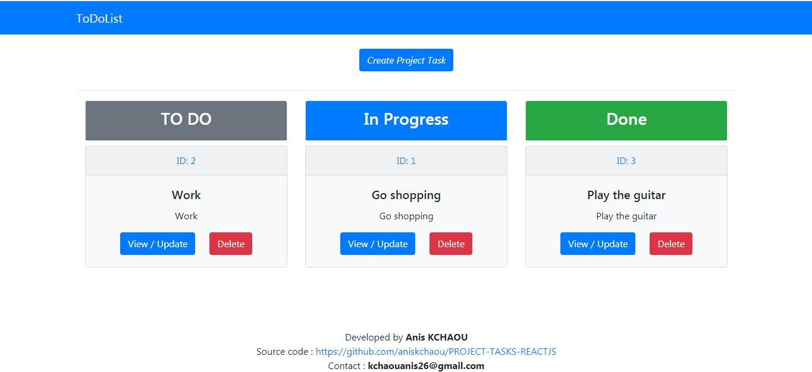

## Description

This project involves developing a ToDoList web application. The list contains a text and a status (to do, in progress, completed) for each item. Through a simple user interface, items can be viewed, edited and deleted.
  
## Demo 

https://project-tasks-reactjs.herokuapp.com/

## Screenshot

 

## Technologies
Spring boot, Reactjs, Redux, Axios, REST, Bootstrap